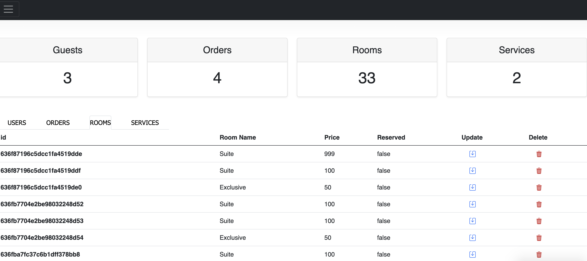
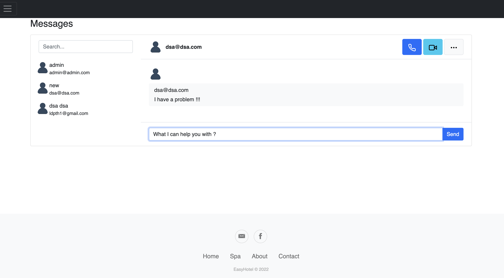

# EasyHotel

An all in one hotel managment system.


## Installation
```
cd EasyHotel
npm install
npm start
```

EasyHotel will listen on: http://localhost:<PORT_ON_.ENV>

## Links
- Our Facebook page: `https://www.facebook.com/profile.php?id=100087333483435`
- Our Email address: `easyhotelinc@gmail.com`

## Pictures

Main page
<p align="center">
  
</p>


Orders page
<p align="center">
  
</p>

Admin panel
<p align="center">
  
</p>


<p align="center">
  
</p>


<p align="center">
  
</p>

Chats
<p align="center">
  
</p>
